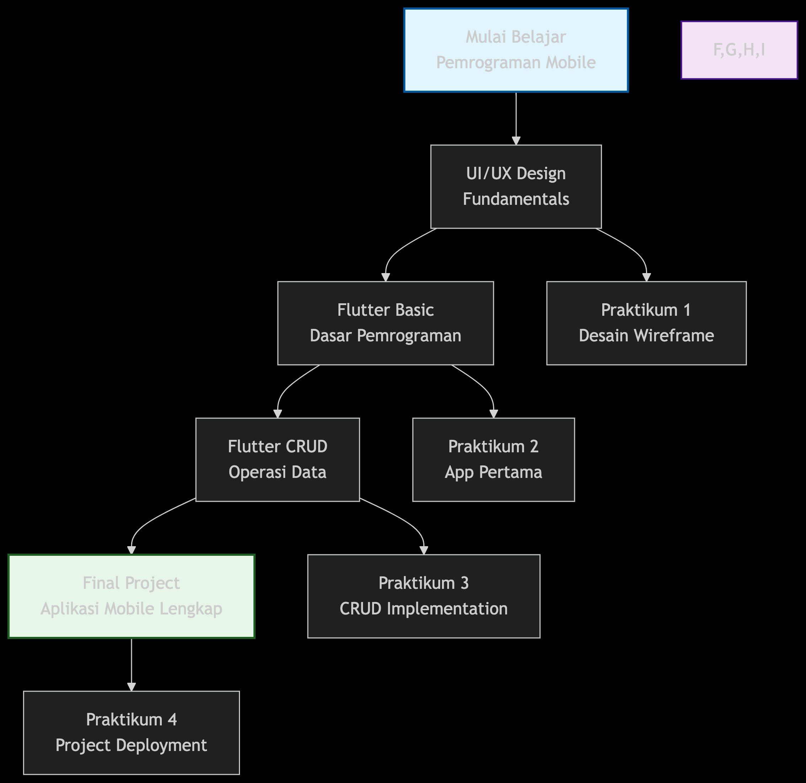

# 📚 Materi Pemrograman Mobile - Peta Pembelajaran

## 🗺️ Peta Pembelajaran Komprehensif

## 📋 Daftar Materi Lengkap

### 1. 🎨 **UI/UX Design untuk Aplikasi Mobile**
**Konsep Inti**: Prinsip desain antarmuka mobile yang efektif dan user-friendly

**Materi Pokok**:
- Prinsip Dasar UI/UX Mobile
- Pola Desain Material Design & Cupertino
- Mobile Design Patterns (Navigation, Forms, Lists)
- Responsive Design untuk Berbagai Ukuran Layar
- Prototyping dengan Figma/Adobe XD

**Praktikum**: 
- Membuat wireframe aplikasi todo list
- Design prototype interaktif
- Usability testing dasar

---

### 2. 🤖 **Flutter Basic - Dasar Pemrograman**
**Konsep Inti**: Menguasai dasar-dasar pembuatan aplikasi dengan Flutter

**Materi Pokok**:
- Pengenalan Flutter & Dart Programming
- Widget Tree dan State Management Dasar
- Layout Building (Row, Column, Stack, Container)
- Navigation dan Routing
- Input Handling (Forms, Gestures)

**Praktikum**:
- Membuat aplikasi kalkulator sederhana
- Implementasi navigasi multi-halaman
- Form validation dasar

---

### 3. 💾 **Flutter CRUD - Operasi Data**
**Konsep Inti**: Mengimplementasikan operasi data Create, Read, Update, Delete

**Materi Pokok**:
- Konsep CRUD dalam Aplikasi Mobile
- Local Storage dengan SQLite & SharedPreferences
- RESTful API Integration dengan HTTP/Dio
- State Management dengan Provider/Bloc
- Form Validation dan Error Handling

**Praktikum**:
- Membuat aplikasi manajemen kontak
- Integrasi dengan REST API
- Implementasi state management

---

### 4. 🚀 **Final Project - Aplikasi Mobile Lengkap**
**Konsep Inti**: Menerapkan semua konsep yang dipelajari dalam project nyata

**Materi Pokok**:
- Project Planning dan Architecture Design
- Implementasi Fitur Lengkap (Authentication, Data Management, etc.)
- Testing (Unit Test, Widget Test)
- Performance Optimization
- Packaging dan Deployment ke Play Store

**Praktikum**:
- Membuat aplikasi manajemen tugas lengkap
- Integrasi dengan Firebase backend
- Deployment ke platform

---

## 🛠️ Tools & Teknologi

**Design & Prototyping**:
- 🎨 Figma / Adobe XD
- 📋 Whimsical / Miro
- 🎭 Prototyping Tools

**Development**:
- ⚙️ Flutter SDK
- 💻 Android Studio / VS Code
- 📱 Flutter Extensions
- 🔧 Dart Programming

**Deployment**:
- ☁️ Firebase / Backend Services
- 📦 Play Store / App Store
- 🔄 Version Control (Git)

---

## 🎯 Target Pembelajaran

**Setelah Modul 1**: Mampu mendesain wireframe dan prototype aplikasi mobile  
**Setelah Modul 2**: Mampu membuat aplikasi Flutter dasar dengan navigasi  
**Setelah Modul 3**: Mampu mengimplementasikan operasi data CRUD  
**Setelah Modul 4**: Mampu membangun dan mendeploy aplikasi lengkap  

---

## 🔗 Resources Support

**Dokumentasi**:
- [Flutter Documentation](https://flutter.dev/docs)
- [Dart Language](https://dart.dev/guides)
- [Material Design](https://material.io/design)

**Komunitas**:
- Flutter Indonesia Community
- GitHub Open Source Projects
- Stack Overflow Flutter Tags

**Learning Platforms**:
- Dart Pad untuk praktik online
- Flutter Samples Gallery
- Codelabs Flutter

---

**📊 Tingkat Penyelesaian**: Modular - Dapat disesuaikan dengan kebutuhan  
**🎓 Level Target**: Junior Mobile Developer  
**🏆 Sertifikasi**: Portfolio-based Assessment  

*"Belajar membangun aplikasi mobile yang tidak hanya berfungsi, tetapi juga menyenangkan untuk digunakan"* 🚀